# CareerVisionAi.com
Build ATS-optimized resumes, write AI cover letters, and practice with our voice-enabled AI Interview Simulator. Career Vision AI is the ultimate career preparation suite to help college students and job seekers land their dream roles. Start building your resume today at [careervisionai.com](https://careervisionai.com).

# Career Vision AI — Professional AI Resume Builder & Voice Interview Simulator

**[Career Vision AI](https://careervisionai.com)** is an advanced, production-ready career readiness platform designed to help job seekers and college students land their dream roles. The platform automates resume creation, optimizes documents for Applicant Tracking Systems (ATS), and simulates real-world job interviews using voice-enabled AI feedback.

---

## 🚀 Key Platform Features

| Feature | Description | Target Link |
| :--- | :--- | :--- |
| **ATS Resume Builder** | Create formatted, ATS-compliant resumes with real-time feedback and keyword optimization. | [Build Resume](https://careervisionai.com/) |
| **Voice AI Interview Simulator** | Practice job interviews in real-time with responsive, audio-enabled AI interviewers and detailed scoring. | [Simulate Interview](https://careervisionai.com/interview-simulator) |
| **AI Cover Letter Writer** | Instantly generate tailored, job-specific cover letters that highlight your achievements. | [Write Cover Letter](https://careervisionai.com/features) |
| **Pricing & Access** | Select premium subscription packages, pricing tiers, and credit structures. | [Pricing Tiers](https://careervisionai.com/pricing) |

---

## 📷 App Screenshots & Showcase

### 🚀 Platform Overview & Landing Page
<table width="100%">
  <tr>
    <td width="50%" align="center">
      <b>Landing Page Header</b> 
      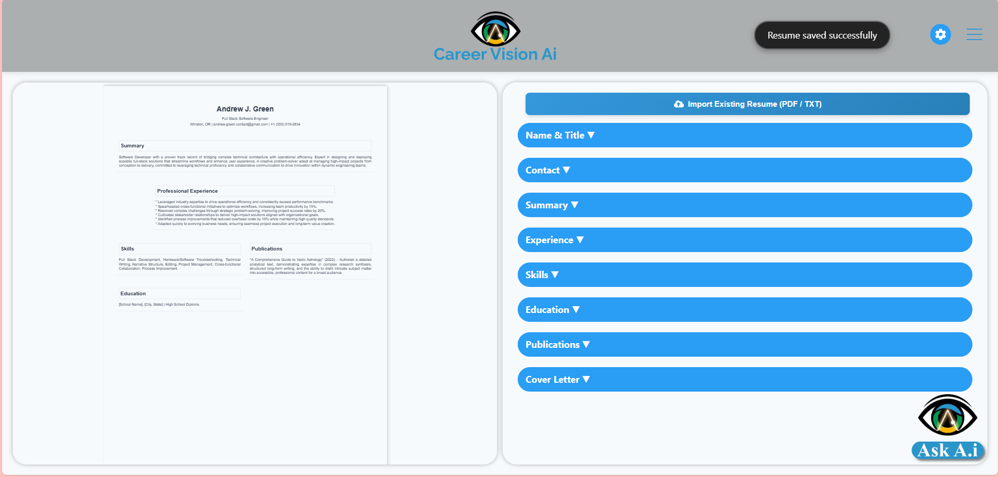
    </td>
    <td width="50%" align="center">
      <b>Interactive Features Showcase</b> 
      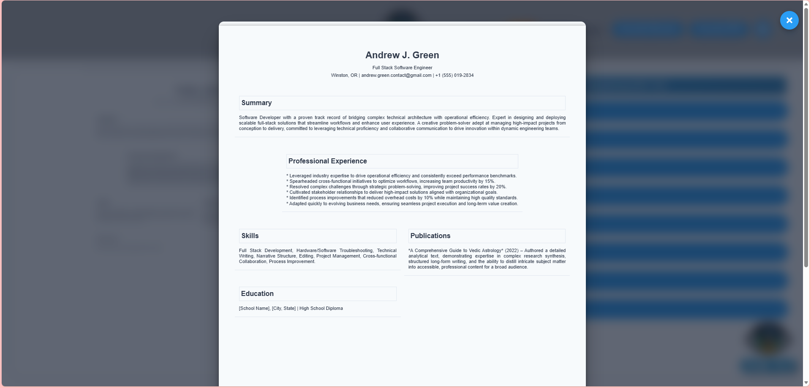
    </td>
  </tr>
</table>

### 📝 ATS Resume Builder & AI Chatbot Copilot
Create formatted, ATS-compliant resumes with real-time AI feedback and speech-to-text keyword optimization.
<table width="100%">
  <tr>
    <td width="50%" align="center">
      <b>Interactive Resume Editor</b> 
      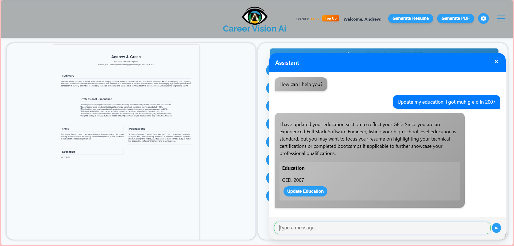
    </td>
    <td width="50%" align="center">
      <b>AI Resume Copilot Chat</b> 
      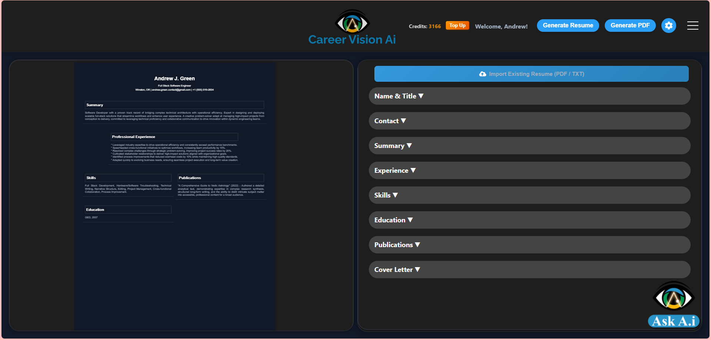
    </td>
  </tr>
  <tr>
    <td width="50%" align="center">
      <b>Speech-to-Text Voice Inputs</b> 
      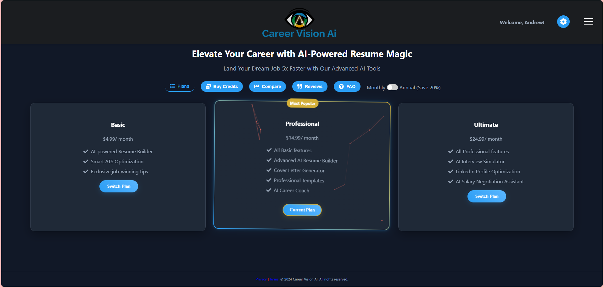
    </td>
    <td width="50%" align="center">
      <b>Template Selection & Theme Customization</b> 
      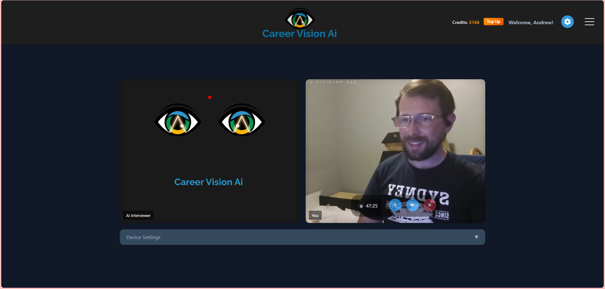
    </td>
  </tr>
</table>

### 🎙 Voice AI Interview Simulator
Practice job interviews in real-time with responsive, audio-enabled AI interviewers. Get instant scoring and comprehensive feedback on your performance.
<table width="100%">
  <tr>
    <td width="50%" align="center">
      <b>Live AI Audio Interview</b> 
      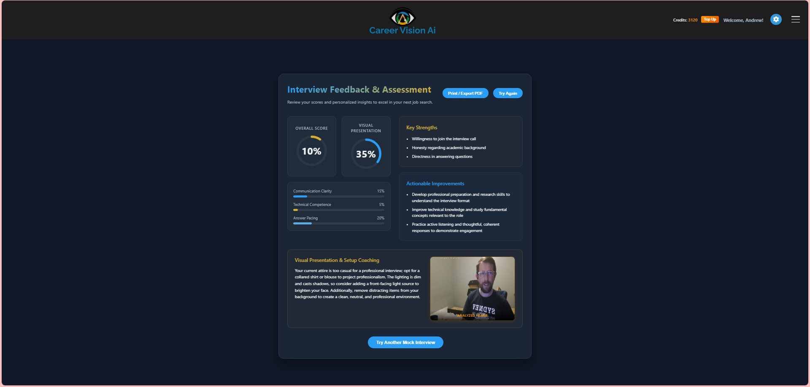
    </td>
    <td width="50%" align="center">
      <b>Interview Simulator Configuration</b> 
      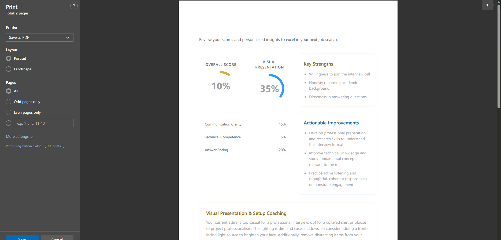
    </td>
  </tr>
  <tr>
    <td width="50%" align="center">
      <b>Real-Time Speech Analysis</b> 
      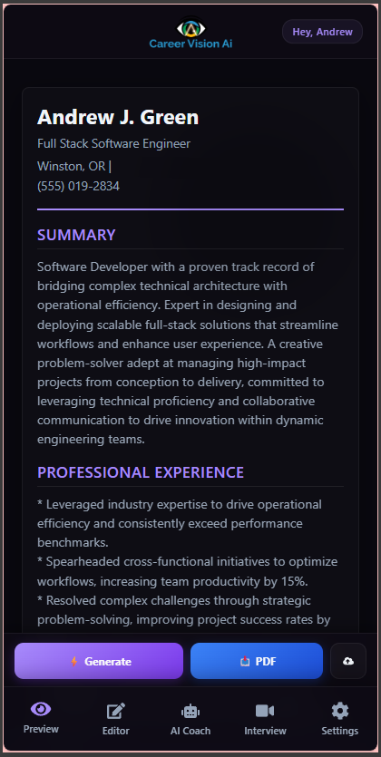
    </td>
    <td width="50%" align="center">
      <b>Detailed Performance Scoring & Feedback</b> 
      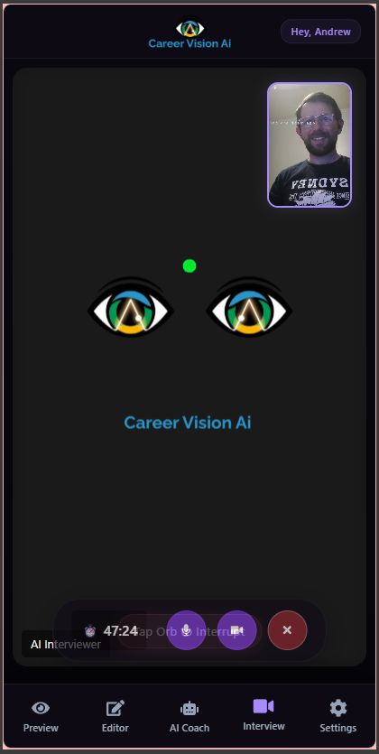
    </td>
  </tr>
</table>

### 💳 Premium Control Board & Billing Management
Select premium subscription packages, pricing tiers, and credit structures.
<table width="100%">
  <tr>
    <td width="50%" align="center">
      <b>Premium Admin Control Panel</b> 
      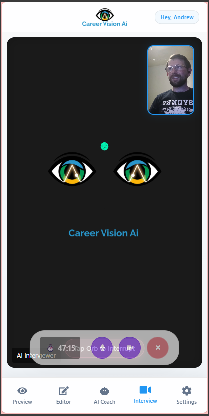
    </td>
    <td width="50%" align="center">
      <b>Flexible Credit Tiers & Billing</b> 
      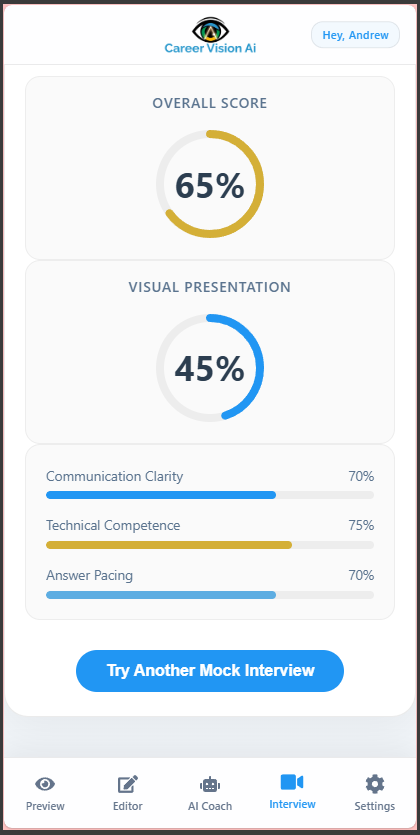
    </td>
  </tr>
</table>

---

## 🛠 Technical Highlights

*   **Front-End Stack**: Dynamic React SPA layout optimized for high Interaction to Next Paint (INP) responsiveness, debounced layout rendering, and zero Cumulative Layout Shift (CLS).
*   **Back-End API**: Scalable Express server hosted on Cloud Run, featuring dynamic caching and Firestore storage.
*   **SEO & GEO Integration**: Injected JSON-LD schemas (`Product`, `Organization`, `BlogPosting`) and standard Open Graph tags optimized for AI retrieval citations.

---

## 🎓 Target Audience & Student Readiness

Career Vision AI is tailored for **college students, fresh graduates, and transitioning professionals**. By bridging the gap between academic achievements and corporate recruiting requirements, it helps candidates build powerful profiles:
*   Extracting academic project accomplishments into quantitative resume statements.
*   Preparing for high-pressure behavior and technical interviews via voice-simulated practice.
*   Translating classroom learning into ATS-scannable keywords.

---

## 🌐 Creator Ecosystem & Related Projects

This project is created and maintained by **[Andrew J. Green](https://github.com/RorriMaesu)**. Check out other applications in our ecosystem:

*   **[Gnosys AI](https://github.com/RorriMaesu/Gnosys-AI)**: An intelligent study suite designed to help college students organize coursework, optimize note-taking, and prepare for exams.
*   **[LedgerPass](https://getledgerpass.com)**: A stateless, zero-retention financial utility that converts transaction CSV files from Stripe, PayPal, and Square into importable QuickBooks Online formats.
*   **[Mystic's Mirror](https://mysticsmirror.com)**: An interactive digital platform for tarot reading, mindfulness reflection, and spiritual guidance.

---

## 📬 Contact & Support

*   **Website**: [careervisionai.com](https://careervisionai.com)
*   **Support & Inquiry**: [Contact Form](https://careervisionai.com/contact)
*   **Founder Profile**: [Andrew J. Green on GitHub](https://github.com/RorriMaesu)
